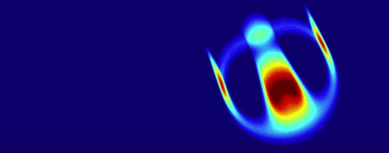

<!-- ### Hi there 👋 -->
<!-- [test](https://gist.github.com/kiol1812/38d3d67dbd6c1cac4a156372c2072d49.js) -->

<!--  -->

<!-- - 🔭 I’m currently working on ... -->
<!-- - 🌱 I’m currently learning `rust🦀` and `NLP` -->

<!--
**kiol1812/kiol1812** is a ✨ _special_ ✨ repository because its `README.md` (this file) appears on your GitHub profile.

Here are some ideas to get you started:

- 👯 I’m looking to collaborate on ...
- 🤔 I’m looking for help with ...
- 💬 Ask me about ...
- 📫 How to reach me: ...
- 😄 Pronouns: ...
- ⚡ Fun fact: ...
-->

	 
        
	 

